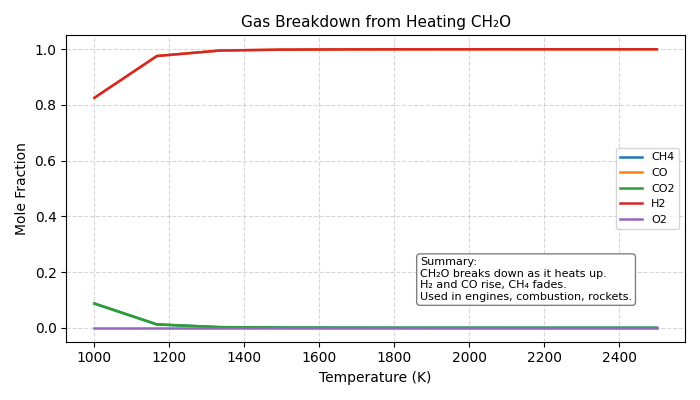

Chemical Reaction Simulator 
(CH₂O Breakdown)

This Python project simulates how a simple fuel molecule (CH₂O) breaks down into gases like H₂, CO, and CH₄ when heated from 1000K to 2500K. It uses the `gaspype` thermodynamics library and visualizes the results with a clean graph.

What It Does?

- Simulates chemical equilibrium using real NASA data
- Visualizes how gases change at different temperatures
- Helps understand real-world combustion (like in engines/rockets)

Built With?

- [Python](https://www.python.org/)
- [Gaspype](https://github.com/DLR-Institute-of-Future-Fuels/gaspype)
- NumPy
- Matplotlib
